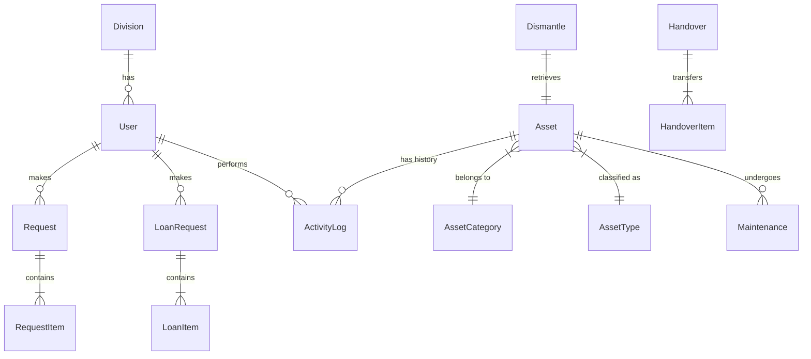

# Dokumentasi Skema Database (Physical Data Model)

Dokumen ini menjelaskan struktur fisik database yang akan diimplementasikan menggunakan **PostgreSQL** dan **Prisma ORM**. Skema ini dirancang untuk mengakomodir seluruh fitur yang ada di prototipe frontend.

## 1. Ringkasan ERD (Entity Relationship Diagram)



## 2. Definisi Model (Prisma Schema)

Ini adalah *blueprint* yang akan digunakan backend untuk membuat tabel database.

### 2.1. User Management
```prisma
model Division {
  id    Int    @id @default(autoincrement())
  name  String @unique // e.g., "Network Engineering", "HR"
  users User[]
}

model User {
  id          Int      @id @default(autoincrement())
  email       String   @unique
  password    String   // Hashed (bcrypt)
  name        String
  role        String   // Enum: 'Super Admin', 'Staff', etc.
  divisionId  Int?
  division    Division? @relation(fields: [divisionId], references: [id])
  
  // Relations
  requests    Request[]
  loans       LoanRequest[]
  activityLogs ActivityLog[]
  
  createdAt   DateTime @default(now())
  updatedAt   DateTime @updatedAt
  deletedAt   DateTime? // Soft Delete support
}
```

### 2.2. Asset Management
```prisma
model AssetCategory {
  id                    Int     @id @default(autoincrement())
  name                  String  // e.g., "Perangkat Jaringan"
  isCustomerInstallable Boolean @default(false)
  types                 AssetType[]
}

model AssetType {
  id              Int           @id @default(autoincrement())
  categoryId      Int
  category        AssetCategory @relation(fields: [categoryId], references: [id])
  name            String        // e.g., "Router", "Kabel"
  classification  String        // 'asset' (satuan) or 'material' (bulk)
  trackingMethod  String        // 'individual' or 'bulk'
  unitOfMeasure   String        // 'Unit', 'Meter'
  assets          Asset[]
}

model Asset {
  id              String   @id // Custom ID: "AST-2025-001"
  name            String
  brand           String
  serialNumber    String?  // Unique for trackingMethod='individual'
  macAddress      String?
  
  // Relations
  typeId          Int
  type            AssetType @relation(fields: [typeId], references: [id])
  
  // Status
  status          String   // 'IN_STORAGE', 'IN_USE', 'DAMAGED'
  condition       String   // 'GOOD', 'MINOR_DAMAGE'
  
  // Location / Assignment
  location        String?  // "Gudang A", "Rak 1"
  currentUser     String?  // Bisa ID User atau ID Customer
  
  // Financial
  purchasePrice   Decimal?
  purchaseDate    DateTime?
  vendor          String?
  warrantyEndDate DateTime?
  
  // History
  logs            ActivityLog[]
  
  createdAt       DateTime @default(now())
  updatedAt       DateTime @updatedAt
  deletedAt       DateTime? // Soft Delete support
}
```

### 2.3. Request & Procurement
```prisma
model Request {
  id              String        @id // "REQ-001"
  requesterId     Int
  requester       User          @relation(fields: [requesterId], references: [id])
  division        String
  status          String        // 'PENDING', 'APPROVED', etc.
  requestDate     DateTime
  
  // Order Details
  orderType       String        // 'Regular', 'Urgent'
  justification   String?
  project         String?
  
  items           RequestItem[]
  
  // Approval Info
  logisticApprover String?
  finalApprover    String?
}

model RequestItem {
  id              Int     @id @default(autoincrement())
  requestId       String
  request         Request @relation(fields: [requestId], references: [id])
  
  itemName        String
  quantity        Int
  approvedQty     Int?    // Quantity after revision
  
  // Procurement Info (Filled by Purchase Admin)
  poNumber        String?
  price           Decimal?
  vendor          String?
}
```

### 2.4. Transactions & History
```prisma
model ActivityLog {
  id          Int      @id @default(autoincrement())
  assetId     String
  asset       Asset    @relation(fields: [assetId], references: [id])
  userId      Int
  user        User     @relation(fields: [userId], references: [id])
  action      String   // "HANDOVER", "REPAIR", "STATUS_CHANGE"
  details     Json?    // JSONB: Menyimpan snapshot data saat log dibuat
  timestamp   DateTime @default(now())
}
```

## 3. Catatan Penting untuk Implementasi

1.  **JSONB vs Relasi**: Untuk fitur seperti `Handover` atau `ActivityLog`, sangat disarankan menggunakan tipe data `JSONB` untuk menyimpan snapshot detail item. Ini menjaga integritas sejarah data (history) meskipun data master aset (nama, brand) berubah di kemudian hari.
2.  **Enum**: Gunakan fitur `enum` di Prisma untuk kolom `status`, `role`, dan `condition` untuk menjaga konsistensi data dan menghindari *typo*.
3.  **Soft Delete (Wajib)**: Kolom `deletedAt` telah ditambahkan pada tabel `Asset` dan `User`. Backend harus selalu memfilter `where: { deletedAt: null }` pada setiap query `find`, kecuali untuk keperluan audit atau restore.
4.  **Constraints**: Pastikan `serialNumber` memiliki constraint `UNIQUE` hanya jika aset tersebut tidak terhapus (Partial Index di PostgreSQL).