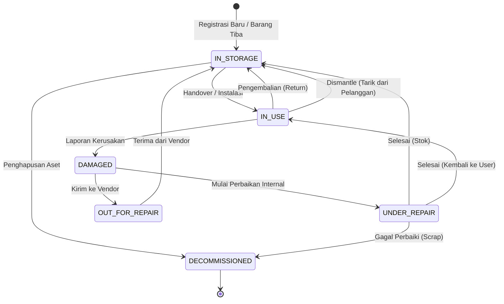
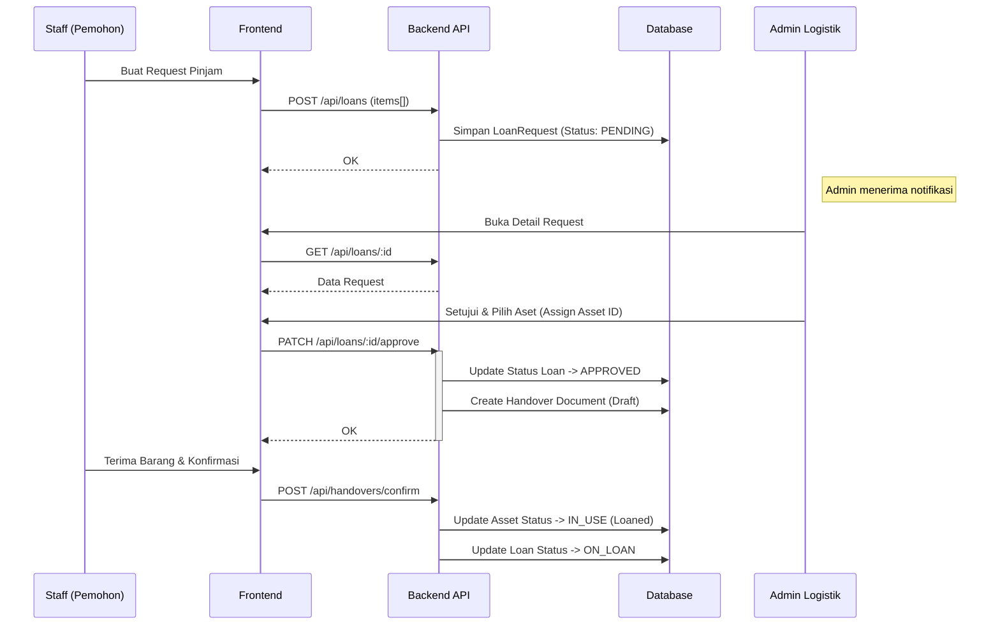
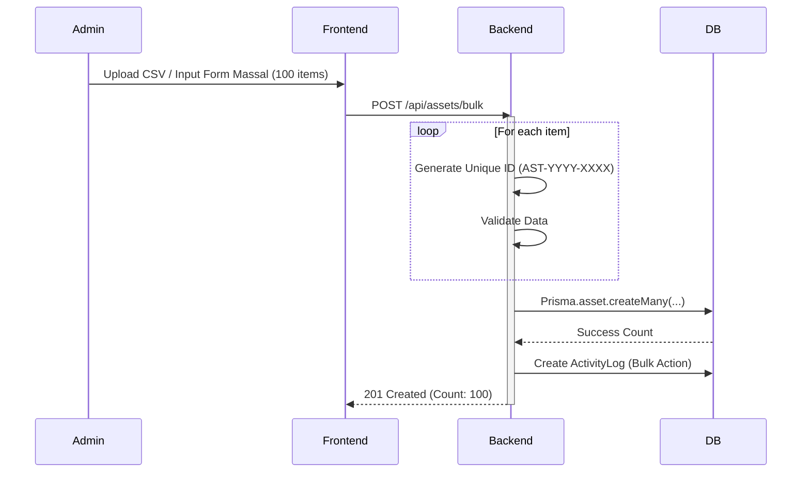

# Diagram Sistem

Dokumen ini berisi diagram teknis mendalam untuk membantu pemahaman alur kerja sistem.

## 1. Siklus Hidup Aset (State Diagram)

Diagram ini sangat penting untuk backend developer memahami transisi status aset yang valid.

## 2. Alur Peminjaman Aset (Loan Request Sequence)

Menjelaskan interaksi kompleks antara User, Admin, dan Sistem.

## 3. Alur Pencatatan Aset Massal (Bulk Registration)

